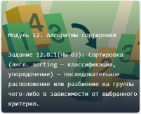

# Go project

<div align="center">
	
</div>

## Usage:

**1.Enter this command to start the program:**

go run main.go

**2.Open the web browser and go to:**

```sh

http://127.0.0.1:8080/ or  localhost:8080

```
## Authors:

@PolinaSvet

**The project was created for educational purposes. It is for test now !!!**

## Menu

01. [](#Task_001) Модуль 5: Основы Go. ЗАДАНИЕ 5.7.1(SC-03)
02. [](#Task_002) Модуль 6. Ветвления, циклы, работа с вводом/выводом. Задание 6.8.1(HW-01)
03. [](#Task_003) Модуль 8. Обработка ошибок и паник, рекурсия, интерфейсы. Задание 8.8.1(HW-01)
04. [](#Task_004) Модуль 8. Обработка ошибок и паник, рекурсия, интерфейсы. Задание 8.8.2(HW-01)
05. [](#Task_005) Модуль 9. Массивы, словари, слайсы, строки, руны и слайсы байт. Задание 9.8.1(HW-01)
06. [](#Task_006) Модуль 12. Алгоритмы сортировки. Задание 12.8.1(HW-03)
07. [](#Task_007) Модуль 13. Деревья, алгоритмы поиска, графы. Задание 13.11.1(HW-03)
08. [](#Task_008) Модуль 14. Хеш-мап, Хеш-функции. Задания 14.6.1(HW-03)
09. [](#Task_009) Модуль 16. Горутины и базовая синхронизация. Задание 16.6.2 (HW)
10. [](#Task_010) Модуль 17. Синхронизация с использованием атомиков и каналов. Задания № 17.3.1, 17.3.3, 17.6.1, 17.6.2, 17.6.3, 17.7.1
11. [](#Task_011) Модуль 18. Wait group, основные шаблоны использования горутин. Задания № 18.2.1, 18.4.1

---

## Task_001

Модуль 5: Основы Go. ЗАДАНИЕ 5.7.1(SC-03)


- ***cmd\web\z_task_001.go***
- ***ui\html\z_task_001_01.html***
- ***ui\html\z_task_001_02.html***
- ***ui\html\z_task_001_03.html***

Создайте новый проект с именем exercise. 
Инициализируйте модуль, напишите в него код, который объявляет пять нетипизированных целочисленных констант с идентификаторами месяцев на английском языке с января по май так, чтобы эти константы имели значения от 1 до 5 — соответственно порядковым номерам месяцев в году.
Выведите каждую из них в консоль. Проверьте, что выводятся правильные номера месяцев. Установите программу с помощью команды go install и проверьте, что ваша программа вызывается отовсюду. Рекомендуем проверить доступность программы хотя бы из двух разных папок.
Попробуйте использовать множественное объявление констант и идентификатор iota, причём только один раз.

[Back to menu](#menu)

## Task_002

Модуль 6. Ветвления, циклы, работа с вводом/выводом. Задание 6.8.1(HW-01)


Напишите программу, которая считывает первое число, затем арифметический оператор (+, -, *, /), затем второе число, после чего, в зависимости от арифметического оператора, производит нужное действие и выводит строку с результатом.

- ***cmd\web\z_task_002.go***
- ***cmd\task\calc\p_calculator.go***
- ***ui\html\z_task_002_01.html***
- ***ui\html\z_task_002_02.html***
- ***ui\html\z_task_002_03.html***

[Back to menu](#menu)

## Task_003

Модуль 8. Обработка ошибок и паник, рекурсия, интерфейсы. Задание 8.8.1(HW-01)


Создайте пакет electronic и добавьте в него интерфейсы.

- ***cmd\web\z_task_003.go***
- ***cmd\task\electronic\p_electronic.go***
- ***ui\html\z_task_003_01.html***
- ***ui\html\z_task_003_01_list.html***

[Back to menu](#menu)

## Task_004

Модуль 8. Обработка ошибок и паник, рекурсия, интерфейсы. Задание 8.8.2(HW-01)


Опишите 2 интерфейса: Auto и Dimensions.

- ***cmd\web\zTask004.go***
- ***cmd\task\auto\pAuto.go***
- ***ui\html\zTask004.html***
- ***ui\html\zTask004list.html***

[Back to menu](#menu)

## Task_005

Модуль 9. Массивы, словари, слайсы, строки, руны и слайсы байт. Задание 9.8.1(HW-01)


Создайте структуру Man, представляющую человека.

- ***cmd\web\zTask005.go***
- ***cmd\task\criminal\pCriminal.go***
- ***ui\html\zTask005.html***
- ***ui\html\zTask005list.html***

[Back to menu](#menu)

## Task_006

Модуль 12. Алгоритмы сортировки. Задание 12.8.1(HW-03)


Создайте структуру Man, представляющую человека.

- ***cmd\web\zTask006.go***
- ***cmd\task\sortCustomTypes\pSortCustomTypes.go***
- ***cmd\task\sortCustomTypesTest\pSortCustomTypesTest.go***
- ***ui\html\zTask006.html***
- ***ui\html\zTask006list.html***
- ***ui\html\zTask006test.html***

[Back to menu](#menu)

## Task_007

Модуль 13. Деревья, алгоритмы поиска, графы. Задание 13.11.1(HW-03)


Реализовать структуры двоичного дерева, неориентированного графа, ориентированного графа.

- ***cmd\web\zTask007.go***
- ***cmd\task\graphBfs\pGraphBfs.go***
- ***cmd\task\graphDfs\pGraphDfs.go***
- ***cmd\task\treeCustom\pTreeCustom.go***
- ***ui\html\zTask007.html***
- ***ui\html\zTask007tree.html***

[Back to menu](#menu)

## Task_008

Модуль 14. Хеш-мап, Хеш-функции. Задания 14.6.1(HW-03)


Реализуйте программу, которая будет находить общие элементы в двух массивах и использовать map для этой цели. Значениями массивов являются строки.

- ***cmd\web\zTask008.go***
- ***cmd\task\mapEqualFind\pMapEqualFind.go***
- ***cmd\task\mapEqualSave\pMapEqualSave.go***
- ***ui\html\zTask008.html***

[Back to menu](#menu)

## Task_009

Модуль 16. Горутины и базовая синхронизация. Задание 16.6.2 (HW)


Напишите структуру, которая будет реализовывать клиент для клиента банковского приложения.

- ***cmd\web\zTask009.go***
- ***cmd\task\bankClient\pBankClient.go***
- ***cmd\task\mapEqualSave\pMapEqualSave.go***
- ***ui\html\zTask009.html***
- ***ui\html\zTask009list.html***

[Back to menu](#menu)

## Task_010

Модуль 17. Синхронизация с использованием атомиков и каналов. Задания № 17.3.1, 17.3.3, 17.6.1, 17.6.2, 17.6.3, 17.7.1


- Задание 17.3.1 (HW-04)<br>
Напишите программу, аналогичную той, что мы только что написали, однако она должна использовать уже не 1000 горутин, а только 10.

- Задание 17.3.2 (HW-04)<br>
Перепишите приведённый выше пример со счётчиком из основного текста, но вместо примитивов из пакета atomic используйте условную переменную и попробуйте реализовать динамическую проверку достижения конечного значения счётчиком.

- Задание 17.6.1 (HW-04)<br>
Напишите код, в котором имеются два канала сообщений из целых чисел, так, чтобы приём сообщений из них никогда не приводил к блокировке и чтобы вероятность приёма сообщения из первого канала была выше в 2 раза, чем из второго.

- Задание 17.6.2 (HW-04)<br>
Напишите код, в котором имеются два канала сообщений из целых чисел так, чтобы приём сообщений всегда приводил к блокировке. Приёмом сообщений из обоих каналов будет заниматься главная горутина. Сделайте так, чтобы во время такого «бесконечного ожидания» сообщений выполнялась фоновая работа в виде вывода текущего времени в консоль.

- Задание 17.6.3 (HW-04)<br>
Напишите программу, которая делает следующее: одна горутина по порядку отсылает числа от 1 до 100 в канал, вторая горутина их принимает в правильном порядке и печатает на экран (в консоль).

- Задание 17.7.1 (HW-04)<br>
Напишите код, в котором несколько горутин увеличивают значение целочисленного счётчика и синхронизируют свою работу через канал. Нужно предусмотреть возможность настройки количества используемых горутин и конечного значения счётчика, до которого его следует увеличивать.


- ***cmd\web\zTask010.go***
- ***cmd\task\chTask1\pChTask1.go***
- ***cmd\task\chTask2\pChTask2.go***
- ***cmd\task\chTask3\pChTask3.go***
- ***cmd\task\chTask4\pChTask4.go***
- ***cmd\task\chTask5\pChTask5.go***
- ***cmd\task\chTask6\pChTask6.go***
- ***ui\html\zTask010.html***

[Back to menu](#menu)

## Task_011

Модуль 18. Wait group, основные шаблоны использования горутин. Задания № 18.2.1, 18.4.1


- Задание 18.2.1 (HW-04)<br>
Создайте программу, которая запускает 5 рутин, каждая из которых печатает свой порядковый номер 10 раз. Добиться такого результата за один вызов wg.Add.

- Задание 18.4.1 (HW-04)<br>
Измените приведенный выше код по реализации двоичного семафора так, чтобы он описывал не двоичный семафор, а семафор подсчёта.

- ***cmd\web\zTask011.go***
- ***cmd\task\templTask1\pTemplTask1.go***
- ***cmd\task\templTask2\pTemplTask2.go***
- ***ui\html\zTask011.html***

[Back to menu](#menu)


